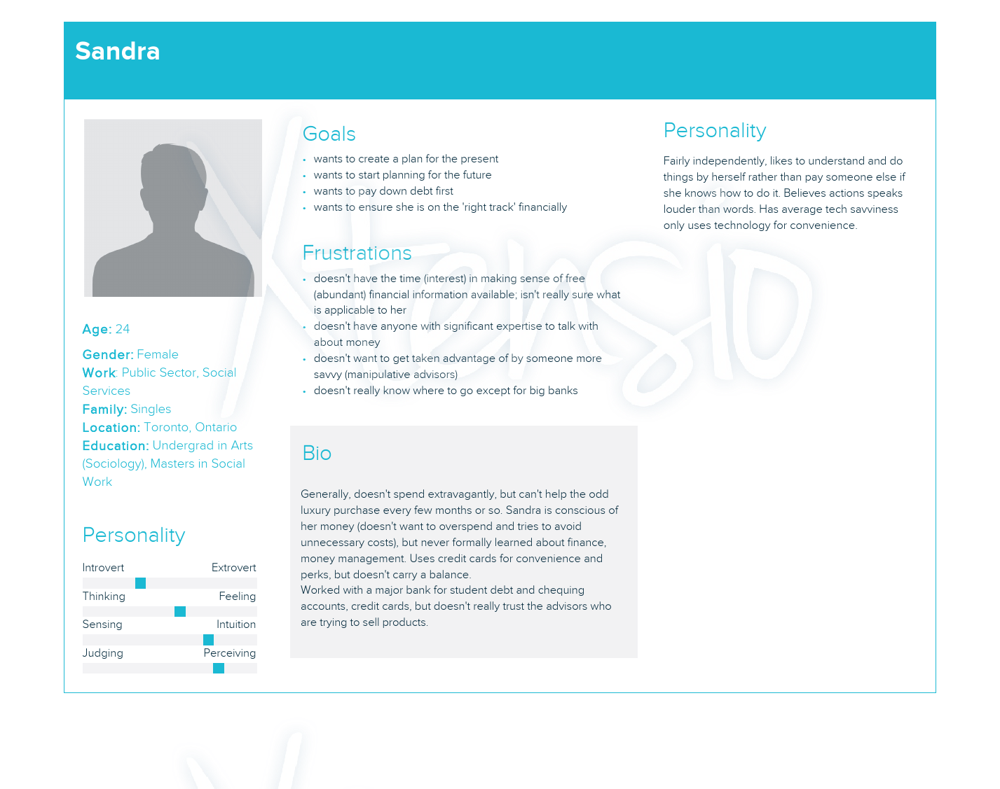

# Mobile Responsive Web Application/Team 26

## CSC301 Deliverable 1 Answers:

### Product Details

#### A1:
We are planning to build a mobile-responsive web application that helps women aged 20-30 have a better understanding of their current financial situation along with helping them plan their future finances. This product is trying to solve the issues that women aged 20-30 have which is a nagging suspicion they should understand money better but haven&#39;t found anything that resonates with them yet. For example a woman who has just started her life as an independent adult wouldn&#39;t have much knowledge about her current financial situation and might not have set financial goals both present and in the future, this application would be able to solve her problem.

Flowchart of Application:

#### A2:

The target users of the application currently are women aged 20-30 but can be used by anyone. An example persona would be:

#### A3:

Users should use our product because it teaches young women how to manage and plan their money. It also saves a lot of time as getting help with managing your money would normally require you to go to your local branch and wait for an advisor but with this application you will be able to get help straight from home. It also allows users to discover new information about their total spending and how much they are saving which might not have been available before if you didn&#39;t look at it closely. The product would provide users with information as to what their potential financial future could be along with their present financial status which helps them set realistic goals. This application doesn&#39;t completely exists in another form as all the other platforms represent only a part of what this application can do for example WealthSimple is mainly for investing, it looks at what you are trying to achieve but our application leans more toward understanding information regarding your money, another example would be Mint as it keeps track of your budget day-to-day but our application looks at budget but in general along with the future as well, local banks would also be a representation of what the application is trying to do but it differs as banks are really sales people trying to sell their investments while we are unbiased as do what is best for the users our application would provide a more robust feature set than any of the other forms of help out there. This application aligns with Untangle Money&#39;s mission because they are trying to help women be financially better off and this application would be a simple to access and easy to use tool which would only serve to contribute to their mission.

#### A4:

The technology stack we will be using to build this web application will be React and maybe Redux for the front-end as requested by the partner and it is the most popular front-end framework for web applications along with d3js to visualize the data. The backend we will be using is Google FireBase as requested by the partner as it is very lightweight and easy to implement for this application. We shall be deploying the application using Heroku because it is commonly used and very easy to deploy with. In terms of the architecture it is quite simple as the user will see the front-end React components and almost all of the user interactions will call on the Google FireBase real-time database to pass back data which we then load into the React components. The partner has stated that the use of API shall be as needed for now we don&#39;t need any APIs but we have discussed maybe using an API to implement a live chat feature. The testing strategy we will be using is each person shall implement their own unit tests for the components they are working on and before final approval we shall have Walker as an extra tester to make sure all the code works as it intends to.

#### A5:

| User Story | Acceptance Criteria |
| --- | --- |
| As an inexperienced user, I want to have a tutorial in order to fully utilize the app. | <ul><li>New users will be shown a series of pop ups that describe the functions of the app</li> <li>Users will be able to access the tutorial through clicking on the the tutorial button on the dashboard page</li></ul> |
| As a new user, I want to register an account in order to see if the app is useful to me. | <ul><li>Users can enter first name, email, password, and confirm password in a form</li> <li>Verification email sent to user after form is filled out</li> <li>App can resend verification email</li></ul> |
| As a satisfied user, I want to share the app with those I know in order to improve their financial lives. | <ul><li>Users can click on share button on any page, fill out an email field, and a personalized email will be sent to the address</li></ul> |
| As a frustrated user, I want to have an app reference in order to use the app in its intended way. | <ul> <li> There is an &quot;Help&quot; button that when clicked, will redirect to an help center page. </li> <li> The help center page will list categories of questions, each of which contains a series of questions and answers </li> </ul> |
| As a registered user, I want to send feedback in order to improve the app. | <ul><li>Users can click on send feedback button on any page, fill out a text field, and the feedback will be sent to the development team or partners</li> </ul> |
| As a registered user, I want to login to the app in order to continue using it. | <ul> <li>Users can enter email, password, and check &quot;remember me&quot; box in form </li> <li> Users can request for a password reset by entering an email. This will cause a password reset form to be sent to their email with password and confirm password fields. If filled out, the user&#39;s password will be changed. </li> </ul>|
| As a registered user, I want to input debt repayment and retirement savings schedules in order to decide which schedule I want to commit to. | <ul> <li> Users can control a debt repayment schedule slider that indicates how slow or fast they will pay back their debt</li> <li> Users can control a retirement savings schedule slider that indicates how small or large is their recurring retirement contribution</li> <li> The choices inputted using the sliders are used to build the scenario's financial components and visualizations</li></ul> |
| As a registered user, I want to manage the financial scenarios that I have created in order to use them in a way that will benefit me the most. | <ul> <li> Users can save scenarios, and saved scenarios can be retrieved at any later date if they are not deleted </li> <li> Users can modify scenarios by changing the financial information or debt repayment and retirement schedules, and all modifications are saved </li> <li> Users can delete existing scenarios, and deleted scenarios cannot be accessed by the user afterwards</li></ul> |
| As a registered user, I want to enter my current financial details in order to see my future financial situation. | <ul> <li> Users can enter their age, income (after tax and deductibles), minimum debt payments, additional debt payments, outstanding debt and interest rate, recurring expenses, retirements savings, and other savings (emergency and non-emergency). Users can enter a start time and end time for the recurring portions. </li> <li> Users will be able to view the future money visualization </li> </ul> |
| As a registered user, I want to enter a change (unemployment, moving, buying a new car) to my financial details at a particular point in time in order to see my future financial situation changes. | <ul> <li> Users can re-enter their income (after tax and deductibles), minimum debt payments, additional debt payments, outstanding debt and interest rate, recurring expenses, retirements savings, and other savings (emergency and non-emergency). Users will also be able to enter a start time and end time for the recurring portions.</li> <li> Visualizations will be updated to show how the new financial situation compares to the old financial situation by having the option to overlay the two situations</li> </ul> |

----

### Process Details

#### A6:

The roles and responsibilities of each member will be similar as the partner requested we didn't implement a back-end and instead use Google FireBase, as such all members will all be working on the front-end of the web application. In terms of non-software related work Justin will be the point of contact between the partner and the group, and Tsing-Chai (Leo) will be responsible for updating the ToDo lists whenever a task is finished or created, and in terms of taking notes we will rotate and have a new note taker every meeting.

Each members roles and responsibilities will differ slightly when it comes to actual coding as there are multiple components to the web application, we decided to divide the work as follows according to the tentative ToDo list we have:

***Main Tasks:***
1. Log-in/Authentication: using Google Firebase Authentication: <strong>Walker (Zexi)</strong>

2. Financial &#39;profile&#39; Intake: allow users to input required financial information to establish their &#39;baseline&#39; financial situation (e.g., income, expenses, debt, savings): <strong>Walker (Zexi)</strong>

3. Financial Decisions: allow users to indicate what financial decisions they are interested in exploring:

   a) How quickly should I pay off my debt? <strong>Walker (Zexi), Leo (Tsung-Ching) </strong>

   b) How much should I contribute to retirement? <strong>Justin</strong>

   c) How much can I spend on a house/condo? <strong>Ethan</strong>

   d) If I want kids, how do I plan for the cost associated with them? <strong>Leo (Tsung-Ching), Justin, Ethan </strong>

4. Financial decision &#39;scenario&#39; analysis: display slider(s) to allow users to quickly modify their &#39;decision&#39; and other input(s) to adjust associated input assumptions: <strong>Leo (Tsung-Ching) (3a, 3d), Justin (3b, 3d), Ethan (3c, 3d)</strong>

5. Data visualizations: display visualizations of key financial outcomes (e.g., budget NOW, FUTURE savings and retirement balances): <strong>Zehao, Leo (Tsung-Ching) </strong>

6. Save/Modify/Delete scenarios: store any inputs the user has made, along with the calculated outputs and visualizations so that they can be modified or reviewed later: <strong>Justin, Ethan</strong>

***Extra Features***

We discussed with the partners the following extra features, and all them were approved. Implementing these features is optional and team members who finish their required tasks listed above can choose whether to work on them.

1. For each financial decision, the app can display different outcomes of that decision and how risky that decision is overall. The app can display the different outcomes related to that decision (e.g. not spending on education, spending and dropping out, spending and getting a degree) and how likely each of the uncertain branches (those involving spending on education) are based the user's past education experience or their anticipated future lifestyle changes. The app can summarize the analysis with a single risk level (e.g. not risky, moderately risky, very risky) associated with the decision. These considerations apply to other decisions with uncertain outcomes such as borrowing money to buy a home or starting a business.
2. When users register, there can be a sliding introduction where users can set up their initial information such as household, lifestyle, and financial information. These values can later be changed by the user in the settings. Afterwards, there can be a tutorial of the app using a sequence of hint pop ups. From that point on, the user can refer to an help center for questions that are not appropriate for the introductory tutorial.
3. There can be a different app display for women with family. In this case, analysis of sensitive information can be shared with certain family members that the user can decide such as her husband or parents.
4. Users can set goals (e.g. owning a house by age X or retirement by age Y), and the app can automatically generate plans that can reach those goals based on preferences set by the user (e.g. maximizing leisure time, providing more care to children).
5. Users can use an investment tutorial involving a simulator where the effects of different types of investments (e.g. real estate, stocks, bonds) can be visually displayed to the user. This suggestion is based on the statistic in the organization details document that 60% of women believe that not having the knowledge to invest is their primary barrier to investing. Another reason is that many of the decisions we offer to the user are based on different types of investments so we want to ensure the user understands how these different types of investments work.
6. Augment the graph with certain common choices that the user can make. When the user selects those choices, the graph will be updated to show how much that choice will generate in contributions and interest. The future money chart currently shows how much savings the users will have at some point far in the future. However, it is difficult for users to act upon the fact that savings and investing now will pay off later. By implementing this, users will have a concrete idea of how much specific action that they can take will affect their future savings.

<u>Strengths and Weaknesses of each member:</u>

Walker:

- Strengths: React, SQL, Vanilla Javascript
- Weakness: Lack of experience with Firebase, Node.js, Redux

Leo:

- Strength: React, Sql, Node, experience with login feature.
- Weakness: documentation, animation, SOLID, firebase.

Justin:

- Strengths: Experience with React, Google FireBase and SOLID principles
- Weaknesses: No Experience with d3js, No Experience with Redux, and No Experience with Node.js

Ethan:

- Strength: Experience with SOLID principles, worked with animations in Android Studio, experience with Java.
- Weakness: Very little experience with Javascript, No experience with Node.js or redux.

Zehao:

- Strengths: Flask, Data Visualization (matplotlib, plotly), Pandas
- Weaknesses: React, Firebase, JavaScript

#### A7:

Our weekly group meetings will occur on Zoom every weekend according to when we can find time. For each meeting the purpose will vary but in general we shall provide updates on each person's progress along with discussing any solutions to problems any of us had when trying to implement features. We will also host other events such as code reviews whenever a person has finished implementing their feature to see if it matches what we all believe the acceptance criteria to be.

<strong>First Meeting</strong>:

- Introduced ourselves to the Partner
- Received an overview of the product they wish for us to create
- Got to know the details of every key feature of the app
- Git to know the reason of choosing 20-30 year-old women as target clients
- Discussed preferences for type of technology to be used (React and Google FireBase)
- Went over ten user stories
- Described six alternatives to the Partner and asked for their feedback
- Setup a schedule for meetings in the future (every Tuesday at 10:30am)

<strong>Second Meeting</strong>:

- Presented Sketches of the MVP for the Partner
- Updated the user stories
- Came up with some more features we can add to the application

#### A8:

The artifacts we will use to organize our team will be a To-Do list as it will have all the tasks that need to be completed in order to get an MVP, and a schedule each week which will contain the minimum amount of work that needs to be completed. To keep track of what needs to get done we will all refer to the To-Do list. We prioritize tasks according to those which lay the basic structure of our web application because everyone needs those tasks to be completed first before we implement the more advanced ones. We assign tasks according to the section each person is working on as they would be more familiar with the work in that section. To determine the status of work we will test to see if the code works according to the basic description we are given, and if the partner believes that our implementation fits the idea they want.

#### A9:

**Team Rules:**

1. Do not procrastinate, it is always better to finish early and make little adjustments then to rush towards the end and make lots of mistakes.
2. Always be transparent with the work you have completed so we can stay up to date with the work each person has done.
3. Try to speak with group members using technical terms as it is helpful to build up our ability to speak using terms in the profession.
4. Always try your best, at the end of the day we are all here to learn, if there is something you don&#39;t know you can always talk to other members of the group or even our Instructors/TAs.
5. Always be respectful and professional, we are all peers and will be working together for the next couple of months so lets make the best out of it.

**Communication:**

- The expected frequency of communication is every 2-3 days through Facebook Messenger.
- If anybody in the group has any questions they need to ask, they can send a question directly to the partner but must include all other group members in the email, and if the partner sends a message to the point of contact he must share the email with the rest of the group.

**Meetings:**

To hold each member accountable for completing their assigned tasks, each member will have 2 chances to miss their deadline but if the group member provides a reason as to why they cannot complete their task well in advance of the deadline then we will extend the deadline of the due date by 1 week. If a group member has used up their two chances then the group makes a report to the assigned TA for our project.

**Conflict Resolution:**

1. Indecisions: in any cases where a consensus cannot be reached, then all five members must vote on the choice they want.
2. Non-Responsive Team Members: if a member hasn&#39;t checked in for 2-3 days we will give them 1 extra day, after that reach out the TA to see if they can contact them.
3. Bullying: if a member of the group is verbally abusive and bullies another member of the group we will ask the TA to remove that member from the group immediately.
----

### Meeting Highlights:

One decision that we had to make as a team was if each person would work on several required functionalities at once or if each person should be confined to working on as few functionalities as possible. The first option would give us more opportunities to learn how to use new software while we would work more efficiently under the second option. In the end we decided efficiency was more important because the cost for each team member to understand significant amounts of code written by other team members is too great, and this burden will only increase as the codebase grows in size. This loss of efficiency is especially detrimental in this time where many classes are bumping up the workload for online delivery. Moreover, using the same technologies that one has used before does not mean they are not learning anything as they will become even more specialized in that technology.

To efficiently divide the work among us, one insight we had was that subsets of the functional requirements must be done together (e.g. functionalities 3, 4, and 6) while others can be done independently (e.g. functionalities 1, 2, and 5). The justification for this is that implementing functionality 4 requires knowing what decisions are being considered when implementing functionality 3 in order to construct a scenario model. Similarly, functionality 6 requires knowing the scenario model inside the database in order to know how to save or modify it. Thus, functionalities 3, 4, and 6 must be done by the same people to be efficient. On the other hand, functionalities 1 and 2 each define a view or series of views where the underlying logic must extract data from the user to pass on to the other functionalities. However, these two functionalities do not require data from the other functionalities and so do not have dependencies with other functionalities. Functionality 5 can be implemented using only the user&#39;s income, savings, debt, and assets to create a visualization, and does not require knowing where they originate from. As a result, the scenario analysis performed by functionality 4 only needs to feed its output to the input of functionality 5 in a predefined and unchanged format to fully create the visualizations. Thus, functionalities 1, 2, and 5 are most efficiently done with a single or a few team members focused on implementing them. These constraints simplified our work in finding the most efficient assignment of tasks.

We discussed with the partners the idea of allowing users to enter information for specific financial events such as becoming employed, buying a home or car, or having children. The partners preferred to capture all of these decisions using a generic interface where the user would enter the new income or expense without the system knowing what caused it. This approach has the advantage of being simple to the user, removes redundancy that occurs when copying the same user input logic, and does not require scenario synchronization between the input interface and the visualizations. Also, focusing on implementing a generic interface ensures that we build the foundations of the application first and ensures less time is spent on implementing unnecessary functionality that could instead be used to implement essential functionality. However, our suggested approach provides more personalized results and visualizations for the user. A justification for this that we mentioned to the partners was that since one goal of the application was to emphasize to the user the importance of saving and investing now, we wanted to concretely show the user how their current decisions would affect their savings future to provide actionable advice for the user. To do this, we must allow the user to enter the specific decision that they are considering and its details. In the end, we decided we will fully implement the generic interface before implementing functionality allowing users to enter major financial decisions. This will give us the chance to personalize the interface without this goal conflicting with the greater priority of building the application foundation through implementing the generic interface.